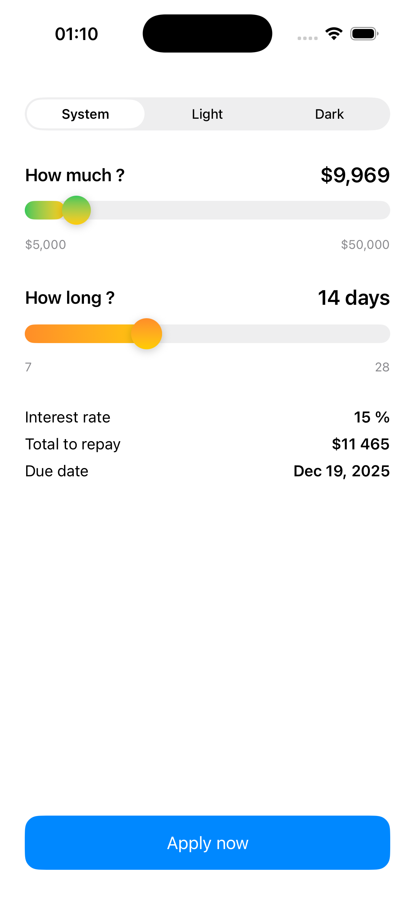
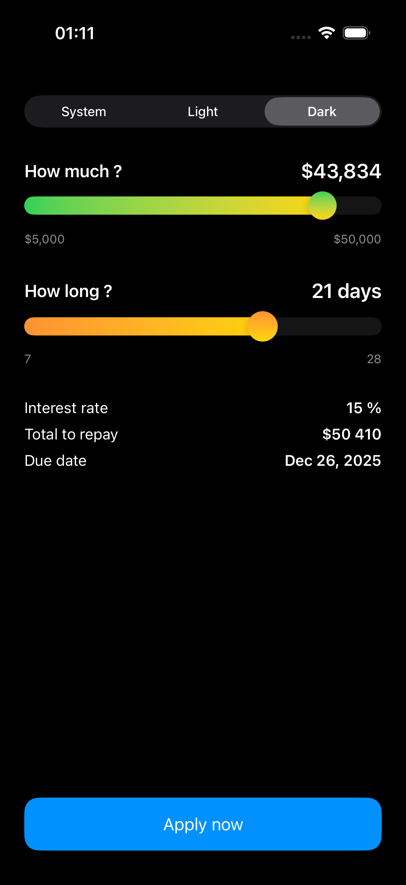

# Loan Calculator (тестовый проект)

## Кратко

- Экран расчета займа: ввод суммы, выбор срока, расчет итоговой суммы и даты возврата, отправка заявки.  
- Архитектура презентации: UDF/Redux-подход (Store + Reducer).  
- Бизнес-логика вынесена в Use Case слой, доступ к данным — через Repository контракты.  
- DI: Swinject (в репозитории присутствует как SwiftPM-пакет).  
- Тесты: Swift Testing (@Suite/@Test, #expect), покрывают ключевые сценарии Store.  

## Стек

- Swift 5.9+, Xcode 15+  
- Swift Concurrency: async/await, @MainActor  
- DI: Swinject  
- Архитектура: UDF/Redux (State, Action, Reducer, Store) + Use Case + Repository  
- Форматирование: Foundation FormatStyle (числа/даты)  
- Тестирование: Swift Testing  

## Где здесь Swinject и зачем

- В корне репозитория есть пакет Swinject (Package.swift экспортирует продукты Swinject и Swinject-Dynamic).  
- Назначение: внедрение зависимостей (Container/Assembler), скопы (transient/graph/container), потокобезопасность и модульная регистрация.  
- В модуле калькулятора зависимости передаются как протоколы (LoanApplicationUseCase, LoanPreferencesUseCase).  
- В реальном приложении они регистрируются в контейнере Swinject в композиционном корне и резолвятся при создании экрана/Store.  
- В тестах используются моки.  

## Структура (ключевое)

- **Package.swift** — SwiftPM-пакет Swinject (поддерживает iOS, macOS, tvOS, watchOS, visionOS).  
- **Calculator** (модуль приложения):  
  - **LoanCalculatorStore.swift** — Store: хранит `LoanState`, применяет `loanReducer`, управляет сайд‑эффектами (загрузка/сохранение префов, отправка заявки), предоставляет вычисляемые значения для UI.  
  - **LoanState.swift** — состояние экрана: `amount`, `termIndex`, диапазоны, `terms`, `isLoading`, `result`, `errorMessage`, `theme`.  
  - **LoanApplicationRequest.swift / LoanApplicationResult.swift** — модели запроса/результата.  
  - **DomainError.swift** — доменная ошибка.  
  - **Use cases**:  
    - `LoanApplicationUseCase.swift` — протокол + `DefaultLoanApplicationUseCase` (делегирует в Repository).  
    - `LoanPreferencesUseCase.swift` — протокол + `DefaultLoanPreferencesUseCase` (делегирует в Repository).  
  - **Repositories (контракты)**:  
    - `LoanApplicationRepository.swift` — отправка заявки.  
    - `LoanPreferencesRepository.swift` — загрузка/сохранение преференций и темы.  
- **Tests**:  
  - `LoanCalculatorStoreTests.swift` — тесты Store на Swift Testing.  
  - Моки: `MockLoanApplicationUseCase.swift`, `MockLoanPreferencesUseCase.swift`.  

## Как это работает (коротко)

- `Store` (`@MainActor`) хранит `LoanState` и принимает `LoanAction` через `send(_:)`.  
- `.setAmount` / `.setTermIndex` — применяют редьюсер и сохраняют преференции.  
- `.setTheme` — применяет редьюсер и сохраняет тему.  
- `.apply` — выставляет загрузку, формирует `LoanApplicationRequest`, вызывает `useCase.apply`, по результату пишет `result` или `errorMessage` и снимает загрузку.  

Вычисляемые значения для UI:  

- Ставка: `15%`.  
- `totalRepaymentValue = amount + amount * 0.15` (округление).  
- `formattedAmount`, `totalRepaymentText`, `interestRateText`, `dueDateText` (через FormatStyle API).  

## Установка и запуск

1. **Требования**  
   - Xcode 15+, Swift 5.9+  
   - Платформы Swinject: iOS 12+, macOS 10.13+, tvOS 12+, watchOS 4+, visionOS 1+  

2. **Клонирование**  
   - `git clone <repo_url>`  
   - Откройте проект в Xcode (`Package.swift` или `.xcodeproj`/`.xcworkspace` — в зависимости от структуры).  

3. **Зависимости**  
   - Swinject уже в репозитории как SwiftPM-пакет. Xcode подтянет и соберет автоматически.  

4. **Сборка и запуск**  
   - Выберите схему приложения (например, `Calculator`) и соберите (`Cmd+B`).  
   - Запустите на симуляторе или устройстве (`Cmd+R`).  
   - Для устройства при необходимости настройте Signing (Team) в Signing & Capabilities.  

## Тесты

- Xcode: `Product > Test` (`Cmd+U`).  
- Используется Swift Testing:  
  - Проверяется инициализация Store из сохраненных преференций/темы.  
  - Сохранение при изменении суммы/срока.  
  - Корректный расчет `totalRepayment` и `interestRateText`.  
  - Успешная и неуспешная отправка заявки (`result`/`errorMessage`, снятие `isLoading`).  
- Моки: `MockLoanApplicationUseCase`, `MockLoanPreferences

## DI в реальном приложении (пример на словах)
- В композиционном корне создается Container/Assembler (Swinject).
- Регистрируются:
   - LoanApplicationRepository (реальная сеть) -> LoanApplicationUseCase (Default…)
   - LoanPreferencesRepository (например, UserDefaults) -> LoanPreferencesUseCase (Default…)
   - LoanCalculatorStore — резолвится с нужными зависимостями.
- Экран получает готовый Store через контейнер.

## Заметки
- DomainError: Equatable реализован упрощенно (в тестовых целях).
- Реальные реализации репозиториев (сеть/хранилище) опущены — в тестовом проекте достаточно контрактов и моков.
- Store помечен @MainActor для потокобезопасной работы с UI.
